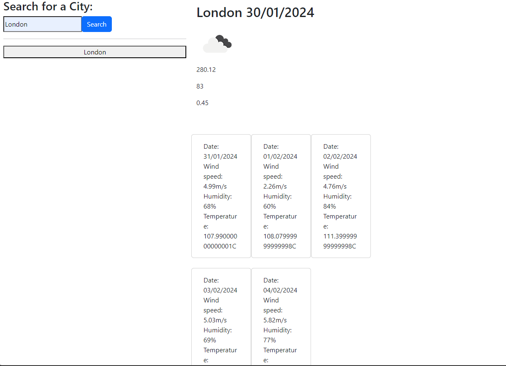

# Weather App

## Description

I have created a app that allows the user to search for a location and specific weather information for that location is displayed on the page.

## Technologies

* JavaScript 
* HTML
* CSS
* Jquery

## Installation

No steps are required for installation.

## Credits

Unix Time converter
https://www.epochconverter.com/programming/

## Usage

https://theoburton.github.io/Weather-APP

Searching for a city by name and hitting search will bring up the weather for the current day as well as the next 5 days.

## License

Please refer to the License agreement in the repository root.